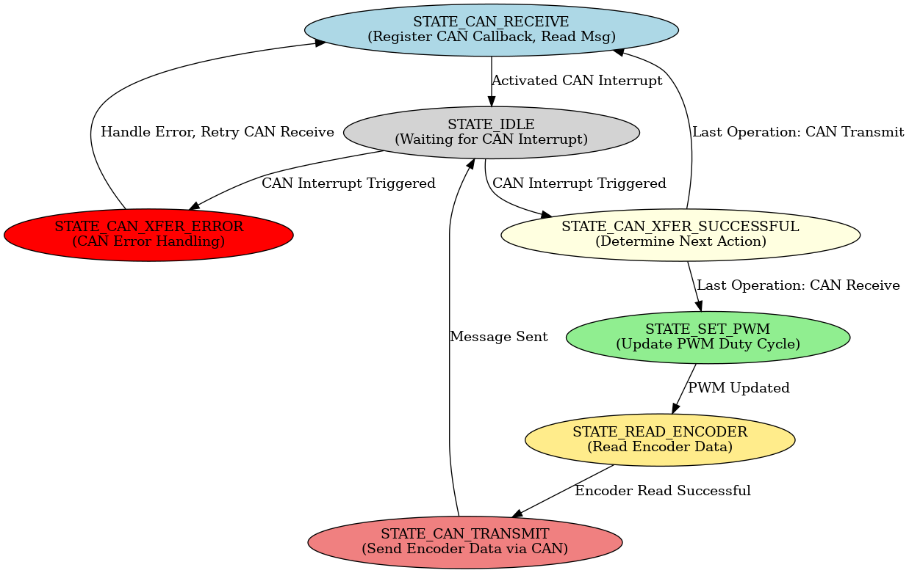

# **Gripper MCU Documentation**

## **How to Use**

1. **Download and Install MPLAB X IDE**  
   - Ensure you have the latest version of **MPLAB X IDE** installed.  
   - If you haven’t installed it yet, download it from the [Microchip website](https://www.microchip.com/mplab/mplab-x-ide).

2. **Import the `gripper_17.x` Project**  
   - Open **MPLAB X IDE**.
   - Go to **File > Open Project** and select the `gripper_17.x` project.

3. **Connect the SAMC21E17A to Your Computer**  
   - Use a **compatible programmer/debugger** (e.g., **PICkit 4, Atmel-ICE, or MPLAB SNAP**).  
   - Ensure the **SWD interface** is properly connected.  

4. **Build and Program the Device**  
   - Click **Make and Program Device** (`F5`) to compile and flash the firmware.  
   - Verify the output in the MPLAB X console to ensure successful programming.
---

## **Peripheral Overview**
The **Gripper MCU** utilizes the following peripherals:

- **Timers (TCC - Timer/Counter for Control)**
  - `TCC0`
  - `TCC1`
- **I²C Interfaces (SERCOM - Serial Communication)**
  - `SERCOM0` → I²C 3 (USART for debugging)
  - `SERCOM1` → I²C 2
  - `SERCOM3` → I²C 1
- **Analog Digital Converter**
  - `ADC0` 
- **Direct Memory Access Controller (DMAC)**
- **Real Time Counter (RTC)**
- **Backup I2C Communication**
  - `SERCOM3`
- **Power Manager (PM)**
- **Communication Interfaces**
  - **CAN FD** (Controller Area Network) for real-time data exchange
- **Watchdog Timer (WDT)**
- **Event Systems (EVSYS)**

---

## **Finite State Machine Representation**
The **state machine** for the **Gripper MCU** is visualized below:

    

---

## **State Machine Explanation**

### **1️⃣ CAN_RECEIVE State**
- In this state, the **CAN receive interrupt** is enabled.
- In the idle state, the MCU willl be set to idle0 sleep mode
- The MCU remains **idle**, waiting for a CAN message.
- The MCU **only exits this state through a CAN interrupt**.
- CAN interrupt will wake the MCU from idle0 sleep mode
- CAN interrupts are deactivated after an interrupt has been triggered

### **2️⃣ PROCESS_PWM State**
- Once the MCU successfully receives a **PWM command** via CAN:
  1. It reads the received **PWM signal** (in **microseconds**).
  2. Converts the **microsecond value** into a duty cycle using the formula:

  
  $$
  \text{Duty Cycle} = \frac{\text{DATA MICROSECONDS} \times (\text{TCC PERIOD} + 1)}
  {\text{PWM PERIOD MICROSECONDS}}
  $$

  - The **PWM signal range** is **700 microseconds to 2300 microseconds**.
  - The **PWM_PERIOD** is 2000 microseconds, and 119999 in **TCC_PERIOD**

### **3️⃣ READ_ENCODER State**
- The MCU reads **all connected encoders**.
- This is done in **Encoder_Read** function
- A Watchdog Timer Reset will be triggered if MCU is stuck in while loop
- The **angle register** for each encoder is:
  - **0xFE** (MSB - Most Significant Byte)
  - **0xFF** (LSB - Least Significant Byte, with 2 unused bits)
- The **raw encoder data** is:
  1. **Adjusted** to remove the **2 unused bits**.
  2. **Stored** in a `uint16_t` array.
  3. **Converted** into a `uint8_t` array for CAN transmission.

### **4️⃣ CAN_TRANSMIT State**
- The processed encoder data (`uint8_t` array) is **sent over CAN** with the ID 0x469.

---

## **CAN ID Table**
CAN FD in FIFO0 is set to only accept ID in the range 0x469 to 0x479.
Each ID has its own purpose. Below is a table showing what each ID used for. 

| ID | Message |
| -------------- | --------------- |
| 0x469 | STOP_GRIPPER |
| 0x46A | START_GRIPPER |
| 0x46B | SET_PWM |
| 0x46C | RESET_MCU |

## **I2C STARTBYTE Table**
To distinguish different types of I2C messages a start byte is used.
Below is a table showing what each start byte means.

| STARTBYTE   | Message   |
|--------------- | --------------- |
| 0x0   | SEND_PWM   |
| 0x1   | STOP_GRIPPER   |
| 0x2   | START_GRIPPER   |
| 0x3   | RESET_MCU   |

## **Current Sense explanation**
ADC is used to read the voltage over the SERVO lines. RTC is used to periodically trigger ADC sampling which
trigger a DMA interrupt after 16 samples. Each sample is 16 samples averaged. If one of the samples
give a current over the current threshold, the corresponding Servo Enable pin be disabled

## **TCC Period Calculation**
To correctly configure **TCC (Timer/Counter for Control)** for PWM generation, we calculate the **TCC period** using the given clock and prescaler.

### **Given Parameters**
- **Clock Frequency**: `48 MHz`
- **Prescaler**: `4`
- **Desired PWM Period** (in microseconds): `PWM_PERIOD_MICROSECONDS`

### **Formula for TCC Period**

$$
\text{TCC PERIOD} = \frac{(\text{Clock Frequency} / \text{Prescaler}) \times \text{PWM Period (μs)}}{2} - 1
$$

### **Example Calculation**
For a **PWM period of 20 ms (50 Hz)**:

$$
\text{TCC PERIOD} = \frac{(48,000,000 / 4) \times 0.020}{2} - 1
$$
$$
= \frac{12,000,000 \times 0.020}{2} - 1
$$
$$
= {120,000} - 1
$$
$$
= 119,999
$$

Thus, for **50 Hz PWM**, the **TCC period should be set to `119999`**.

---

## **Future Improvements**
- 🔹 **Direct Memory Access (DMA)** for efficient data handling.
- 🔹 **Sleep Mode Implementation** for power efficiency.

---

## **Additional Notes**
- The **duty cycle computation** ensures that the received PWM signal is **converted accurately** for motor control.
- **Encoder data handling** is optimized to ensure **precise angular position measurements** before transmission.
- Implementing **DMA & interrupt-based** processing will further **reduce MCU workload and improve real-time performance**.

