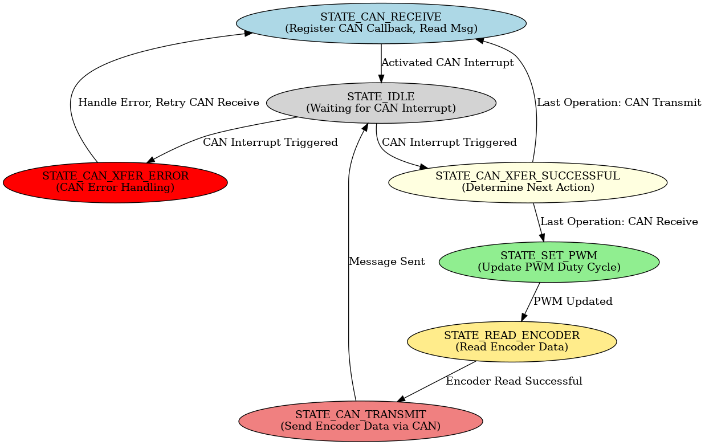

# **Gripper MCU Documentation**

## **Peripheral Overview**
The **Gripper MCU** utilizes the following peripherals:

- **Timers (TCC - Timer/Counter for Control)**
  - `TCC0`
  - `TCC1`
- **I²C Interfaces (SERCOM - Serial Communication)**
  - `SERCOM0` → I²C 3
  - `SERCOM1` → I²C 2
  - `SERCOM3` → I²C 1
- **Backup Communication (Client Mode)**
  - `SERCOM2`
- **Communication Interfaces**
  - **CAN FD** (Controller Area Network) for real-time data exchange

---

## **Finite State Machine Representation**
The **state machine** for the **Gripper MCU** is visualized below:

    

---

## **State Machine Explanation**

### **1️⃣ CAN_RECEIVE State**
- In this state, the **CAN receive interrupt** is enabled.
- The MCU remains **idle**, waiting for a CAN message.
- The MCU **only exits this state through a CAN interrupt**.
- CAN interrupts are deactivated after an interrupt has been triggered

### **2️⃣ PROCESS_PWM State**
- Once the MCU successfully receives a **PWM command** via CAN:
  1. It reads the received **PWM signal** (in **microseconds**).
  2. Converts the **microsecond value** into a duty cycle using the formula:

  
  $$
  Duty\_Cycle = \frac{DATA\_MICROSECONDS \times (TCC\_PERIOD + 1)}
  {PWM\_PERIOD\_MICROSECONDS}
  $$

  - The **PWM signal range** is **700 microseconds to 2300 microseconds**.
  - The **PWM_PERIOD** is 2000 microseconds, and 119999 in **TCC_PERIOD**

### **3️⃣ READ_ENCODER State**
- The MCU reads **all connected encoders**.
- The **angle register** for each encoder is:
  - **0xFE** (MSB - Most Significant Byte)
  - **0xFF** (LSB - Least Significant Byte, with 2 unused bits)
- The **raw encoder data** is:
  1. **Adjusted** to remove the **2 unused bits**.
  2. **Stored** in a `uint16_t` array.
  3. **Converted** into a `uint8_t` array for CAN transmission.

### **4️⃣ CAN_TRANSMIT State**
- The processed encoder data (`uint8_t` array) is **sent over CAN**.

---

## **TCC Period Calculation**
To correctly configure **TCC (Timer/Counter for Control)** for PWM generation, we calculate the **TCC period** using the given clock and prescaler.

### **Given Parameters**
- **Clock Frequency**: `48 MHz`
- **Prescaler**: `8`
- **Desired PWM Period** (in microseconds): `PWM_PERIOD_MICROSECONDS`

### **Formula for TCC Period**
$$
\text{TCC\_{PERIOD}} = \frac{\text{Clock Frequency} / \text{Prescaler} \times \text{PWM Period (μs)}}{1,000,000} - 1
$$

### **Example Calculation**
For a **PWM period of 20 ms (50 Hz)**:

$$
\text{TCC\_{PERIOD}} = \frac{(48,000,000 / 8) \times 0.020}{1,000,000} - 1
$$
$$
= \frac{6,000,000 \times 0.020}{1,000,000} - 1
$$
$$
= \frac{120,000}{1,000,000} - 1
$$
$$
= 119,999
$$

Thus, for **50 Hz PWM**, the **TCC period should be set to `119999`**.

---

## **Future Improvements**
- 🔹 **Fully interrupt-based** operation (reducing CPU load).
- 🔹 **Direct Memory Access (DMA)** for efficient data handling.
- 🔹 **Sleep Mode Implementation** for power efficiency.

---

## **Additional Notes**
- The **duty cycle computation** ensures that the received PWM signal is **converted accurately** for motor control.
- **Encoder data handling** is optimized to ensure **precise angular position measurements** before transmission.
- Implementing **DMA & interrupt-based** processing will further **reduce MCU workload and improve real-time performance**.

